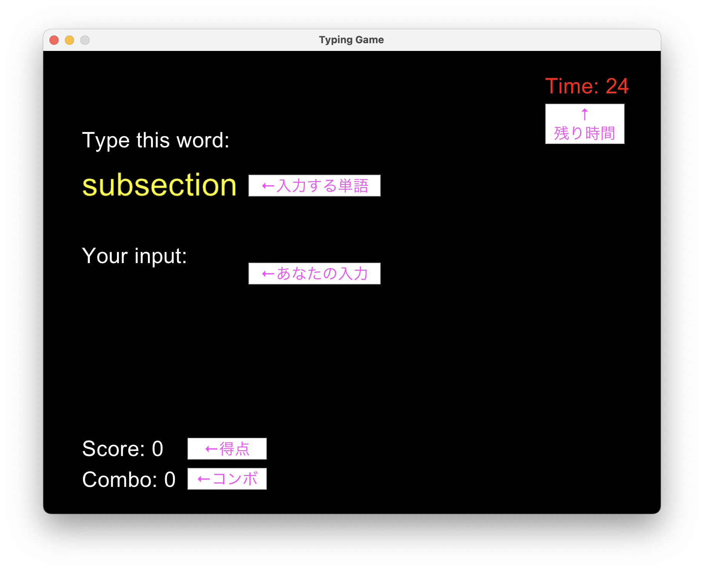

# Typing Game
Rubyの練習用に作成したタイピングゲームです。
様々なプログラミング言語で用いられる構文を問題として取り扱っています。
難易度は、プログラム内での出現頻度(ChatGPT調べ)で割り振っています。

現在対応している言語
- LaTeX
- C
- Python

### プレビュー


## 使用させていただいた音声素材
.gitignoreに設定しているので、各自でのダウンロードをお願いします。

| 用途 | 製作者 | 音源名 | リンク | プログラム内での名称 |
| ---- | ----- |------ |------| ----------------- |
| タイプ音 | 魔王魂 | システム21 | https://maou.audio/se_system21/ | `type.wav` |
| バックスペース音 | 魔王魂 | システム43 | https://maou.audio/se_system43/ | `back.wav` |
| 全削除音 | 魔王魂 | システム44 | https://maou.audio/se_system44/ | `miss.wav` |


## 実行方法
### 1. リポジトリのクローン
以下のコマンドをターミナルで実行してください。
``` bash
git clone https://github.com/tdtiger/typing_ruby.git
cd typing_ruby
```

### 2. Rubyのインストール
#### MacOS
Homebrewによるインストールの場合、ターミナルで以下のコマンドを実行してください。
``` bash
brew install ruby
```

その後、パスを通します。
``` bash
echo 'export PATH="/opt/homebrew/opt/ruby/bin:$PATH"' >> ~/.zshrc
source ~/.zshrc
```

#### Windows
[RubyInstaller](https://rubyinstaller.org/)を用いてインストールします。

### Gosuのインストール
本アプリは、Rubyの外部ライブラリであるGosuを使用しています。
以下のコマンドをターミナルで実行し、ダウンロードしてください。
``` bash
gem install gosu
brew install sdl2
↑ MacOSのみ必要な場合あり
```

### 実行
ターミナルから以下のコマンドを実行すれば、アプリが起動します。
``` bash
ruby main.rb
```

## 遊び方
アプリを起動すると、タイトル画面が表示されます。


Enter(Return)キーを押すと、モード選択画面に移ります。

矢印キーまたは数字キーを使って、遊びたいモードを選んでください。

モードが決まると、難易度選択画面に移ります。

モード選択と同じように難易度を選んでください。
なお、モードを選び直したい場合は←キーを押してください。

いよいよゲーム開始です。

30秒間、画面に表示される単語をどんどん入力していきましょう。
正解が入力されると、自動的に次の問題に移ります。

バックスペースで一文字削除、Enter(Return)キーで全文字削除できます。
ただし、Enter(Return)キーでの削除はコンボがリセットされるので注意！

同梱の`question.json`を編集することで、好きな問題を追加できます。
その場合は、以下のフォーマットに従って記述してください。
``` JSON
{
    "[追加したいモード名]": {
        "easy": [
            "[追加したい単語]",
            "[追加したい単語]"
        ],
        "normal": [
            "[追加したい単語]",
            "[追加したい単語]"
        ],
        "hard": [
            "[追加したい単語]",
            "[追加したい単語]"ß
        ]
    }
}
```